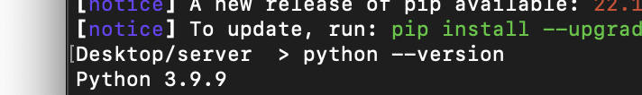

# 220921 Django 1일차 개발 환경 설정 가이드

```
- 가상환경 생성 / 실행
- Django LTS 버전 설치
- Django 프로젝트 생성
- Django 실행
```

〰️

## 1. 폴더 하나를 만든다.


〰️

## 2. 터미널을 열어서 해당 폴더로 위치를 변경한다.
```bash
cd 해당 폴더 주소
```


〰️

## 3. 파이썬이 깔려있는지 확인한다.
```bash
python --version
```



〰️

## 4. 가상환경 폴더 생성
```bash
# 가상환경 폴더 생성
python -m venv server-venv

# 폴더가 만들어졌는지 확인하기
ls

# 목록을 전부 볼 수 있음
ls -a
```


〰️

## 5. 가상환경 활성화하기
```bash
# 윈도우
source server-venv/Scripts/activate

# 맥
source server-venv/bin/activate

# 현재 위치에 따라 명령어가 바뀌니까 현재 위치 알아두고 활성화 명령하기!

# 하고 나면 이렇게 바뀜
(server-venv) 현재 위치 >

```


❗️ 비활성화는?
```bash
deactive
```

〰️

## 6. 그리고 여기는 새로운(빈) 공간이기 때문에 django를 깔아줘야 한다.


```bash
pip list
# 를 입력하면 제대로 깔린게 맞는지 확인할 수 있다.
```


〰️

## 7. 설치가 끝났으면 새 프로젝트를 만든다.
```bash
django-admin startproject firstpjt .

# startproject는 명령어
# 그 다음에 오는 것은 프로젝트 이름
# . 은 현재 폴더를 의미한다.
```


확인해보면 잘 생성된 것이 보인다.

〰️

## 8. vscode에서 확인하기
```bash
code .

# 을 입력하면 vscode에서 창이 열린다.
```


〰️

## 9. 서버 구동하기
```bash
# 파이썬을 이용해 manage.py 파일을 열고 runserver 명령어를 실행시킨다.

python manage.py runserver

# 아래 사진처럼 뜬다면 성공!
```


혹시 안되는 경우에는

[[트러블슈팅]"python manage.py runserver" 개발서버 start(시작)에러 - 작성자 WorldSeeker](https://atotw.tistory.com/313)

참고하기!

〰️

## 10. 인터넷 빈창을 띄우고 주소창에 `localhost:8000`를 입력해보면..!

