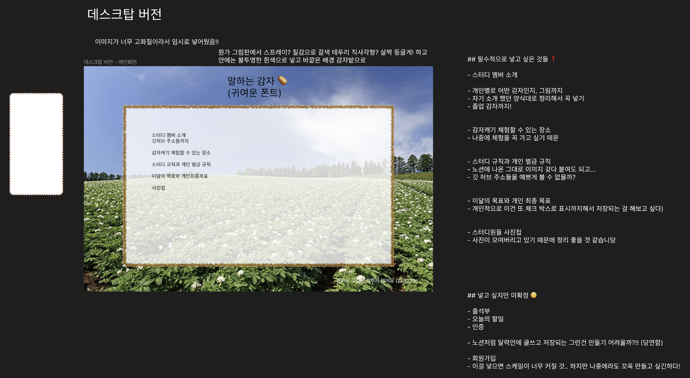

## 230311 개발일지

 

HYUNGWON 프로젝트 레이아웃이 대충 잡히니까  
이번에는 감자 스터디 사이트 구상이 너무 어렵다.  
뭔가 그림판에서 끼꼬끼꼬 그린 느낌을 내고 싶어서 우선 배경은 감자밭으로 두고...  
아무래도 귀여운게 취향이라서 그런가 구상을 해도 전부 귀엽게 만들고 싶어진다.  
그래도 레이아웃은 HYUNGWON 때랑 다르게 잡고 싶어서 아예 메인을 캐러셀로 만들까도 생각하는데  
고민이 된다.

우선 여기도 폰트가 중요할 것 같은데 스터디원 별로 다른 폰트는 쓰지 못해도 대충 3개 이상의 폰트를 사용해서  
저마다 개성을 좀 드러내보고 싶다.  
자주 쓰는 말이나 좋아하는 한마디 같은 걸 프로필과 같이 적어주면 좋을 것 같다.
그리고 배경.. 배경이 좋을 것 같기도 하고
양 옆이나 위 아래 둘 중 하나도 좋을 것 같아서 차차 고민해 보면 좋을 듯 하다.
또 다른 의견이 있었는데 우리 감자 페이지가 애초에 노션에서 만들어진 거니까  
노션을 클론 코딩 해보는 것이 어떻겠냐는 의견도 나왔다.  
그것도 매우 좋을 것 같긴한데... 내가 생각하고 있는 것과 다르기도 하고 그래서 참 고민이 된다.  
노션... 구상에 시간이 많이 들어갈 것 같진 않아서 좋다.  
그리고 만약 노션 클론코딩과는 다르게 지금 구상한 대로 간다면,  
다른 화면으로 넘어갈 때의 아이콘이라던가.. HYUNGWON 때처럼 인덱스의 역할을 하는 친구가 필요하다.  
그 친구를 어떤 식으로 만들지가 정말정말정말 고민된다.  
그려놓은 걸 보니까 칠판에 적힌 것처럼 표현해도 좋을 것 같고...  
꽤 귀여울 것 같지 않나?

 

