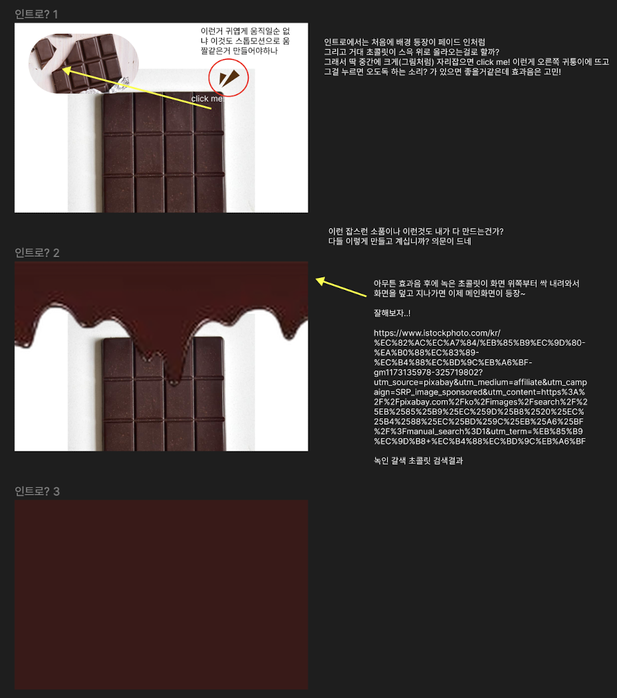
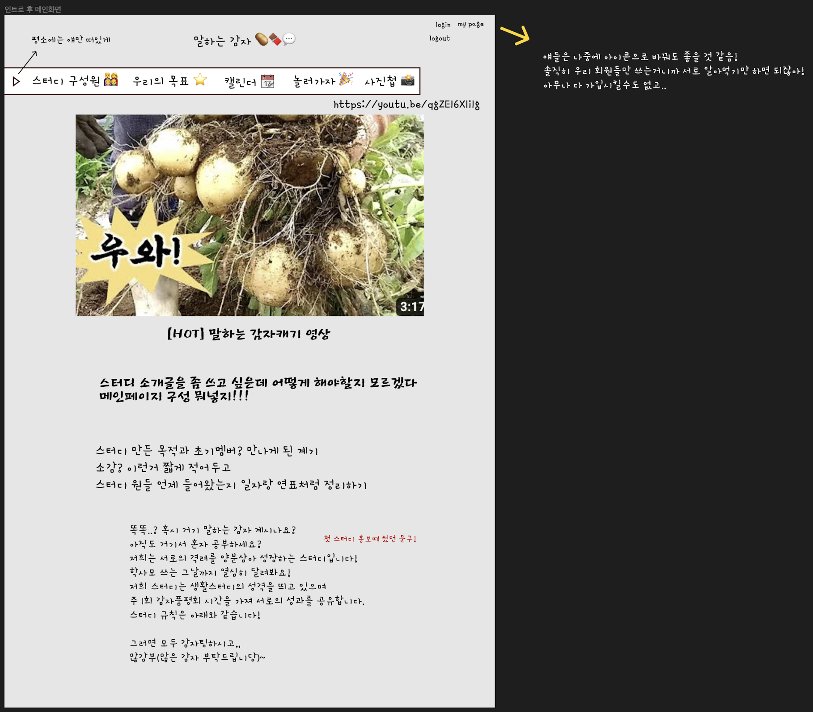

## 230323 개발일지

급하게 아이디어가 떠올라서 냉큼달려왔다.  
사실 스터디 사이트라서 부담도 많이 되고 아이디어가 너무 떠오르는게 없기도 해서 아직도 구상만 한참 하고있는데,  
오늘 색 테마를 확실히 정했다.  
감자밭 이런것도 아니고, 기냥 짙은 갈색을 테마로 잡아서  
갈색하면 떠오르는 것들을 상상하다가 초콜릿이 갑자기 생각났다.  
딱 들어가면 거대 초콜릿 윗부분이 까진 한입 하기 딱 좋은 사이즈의 크기로 윗부분만 보이면  
오른쪽 귀퉁이를 클릭할 수 있게 만들어서  
거길 클릭하고 꿀꺽 소리가 나면 전체 화면이 초콜릿으로 슈루룩 덮였다가 쓸려내려가면서 메인화면이 보이는!  
그리고 메인은 약간 멜란지 그레이? 같은 애매모호한 색에 갈색에 광을 주고 싶다.  
네비가 가운데 정렬로 딱 박혀서 스터디 명이 제일 위에 적혀있고  
맨 아래 내려가면 갈색 감자밭에 감자가 심어져있는 그런 이미지!  
라고 신들린사람처럼 묘사해놨는데 지금부터 피그마에 그리러 가봐야겠다.

일단 기존에 생각해 두었던 그런 푸근한 이미지에 전원일기 bgm 이런건 포기하기로 하고,  
좀 현대적인 디자인(?)으로 방향을 아예 틀어버려야겠다.  
근데 고민이라면 고민인 것은...  
이제 초콜릿과 스터디가 무슨 연관이 있냐... 이건데  
감자 초콜릿 파는 곳... 찾아볼까?ㅎㅎ

지금 검색해보니 초콜릿 감자칩이 나오는데 그게 맛있어보이니까 만든걸로 하자.  
충격적인 탄생 배경

이게 인트로? 화면 구상

이게 인트로? 후 메인화면 구상

하고 있는 중인데 메인화면이 또 귀엽게 변해가고 있다...  
어떡하면 좋지  
모던하게 하려고 했는데 말하는 감자 스터디명에 맞게 폰트를 바꾸니까  
이것저것 귀여워 지려고 한다 최대한 귀엽지 않게 변형하고 싶다...ㅠㅠㅠㅠ  
그리고 메인화면에 어떤걸 넣어야할지 너무 고민돼서 일단 냅다 영상 재생할 수 있게 넣어놓고  
아래에 스터디 소개글 적고...  
오 만나게 된 과정 이런거 적으면 좋을거같은데!!  
약간 스터디원 합류 역사(?) 이런거 정리해두면 쓸데 없고 좋을듯

메인화면 구상중에 고민되는 것이 있는데  
내가 생각한 깔끔한 이미지대로 가려면 원래 네브바를 만들어야하는데  
뭔가 폰트와 분위기에 휩쓸려서 저 롤형식? 메뉴를 만들게 됐다.  
저걸 다시 네브바로 바꿀까 싶기도 하고  
뭔가 내가 생각했던 깔끔한 형식의 네브바를 만들면 메뉴도 뭔가 영어로 써야할 것 같고...  
온전히 내 취향이 담겨서 그런가 자꾸 너무 사심이 반영되는게 문제다...  
모던! 깔끔! 현대적인거(?)!  
잊지말고 구상에 신경 써야할 것!
