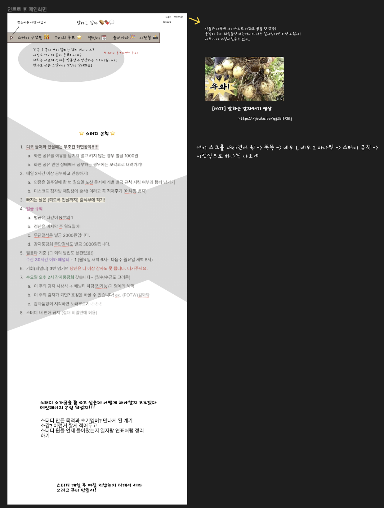

## 230324 개발일지

우선 피그마에 한글 폰트 입힐 때, 폰트 찾는게 너어어ㅓㅓㅓ무 오래 걸려서 방법이 없을까 알아봤는데 방법 없는듯..  
그냥 알아서 찾아야겠다.

어제랑 좀 바뀐게 있다면 화면을 스크롤 내릴 때 맞춰서 설계하고 싶어서 더더 길게 내렸고,  
스크롤 내릴 때마다 요소 하나씩 바뀌는 느낌으로다가 적어놨다.  
규칙을 따로 적는 칸을 안 만들고 메인에 두면 될 거 같아서 규칙을 메인에 뒀는데  
배경이 너무 심심해질까봐 배경에 그.. 폴리스 라인 처럼 딱지 붙는 느낌으로 네모가 하나씩  
날아와서 붙고 규칙이 나중에 올라가는~  
영상은 넣으면 너무 구수해질거같아서 일단 빼뒀다. 다시 안넣거나,, 아님 감자캐기 장소 정리 하는 곳에 넣을까? 싶기도 하다.  
소개글 - 규칙 - 멤버들 들어온 시기 정리 - 스터디 개설 후 디데이 - 푸터  
이 구조로 메인화면은 굳히기 들어갈거같고,,  
근데 아직 맘에 안들어서 자주 고치는 중이다.  
한글 폰트도 피그마에 적용하려면 하나하나 대조해봐야할거같고..^^  
네브바는 폰트 고쳐지면 바로 고칠거같은 느낌이 든다  
아무래도 흰배경에 깔끔한 흰배경 네브바가 이쁘긴하니깐~  
회색은 폰트랑 어우러지니까 뭔가 자꾸 이미지가.. 또 그쪽으로....  
소개글도 좀 덜 친근하게(?) 다시 바꿔야겠다.

초콜릿 이미지는 사면 되는 것들 찾았는데 무료이미지 시간 더 들이면 찾을 수 있을거같기도하고,,,  
그냥 메이드 바이 지선으로 두는 게 나을 거 같기도 하고 그렇다.  
주말에 초콜릿 사러 대형마트 탐방 가야겠음.

