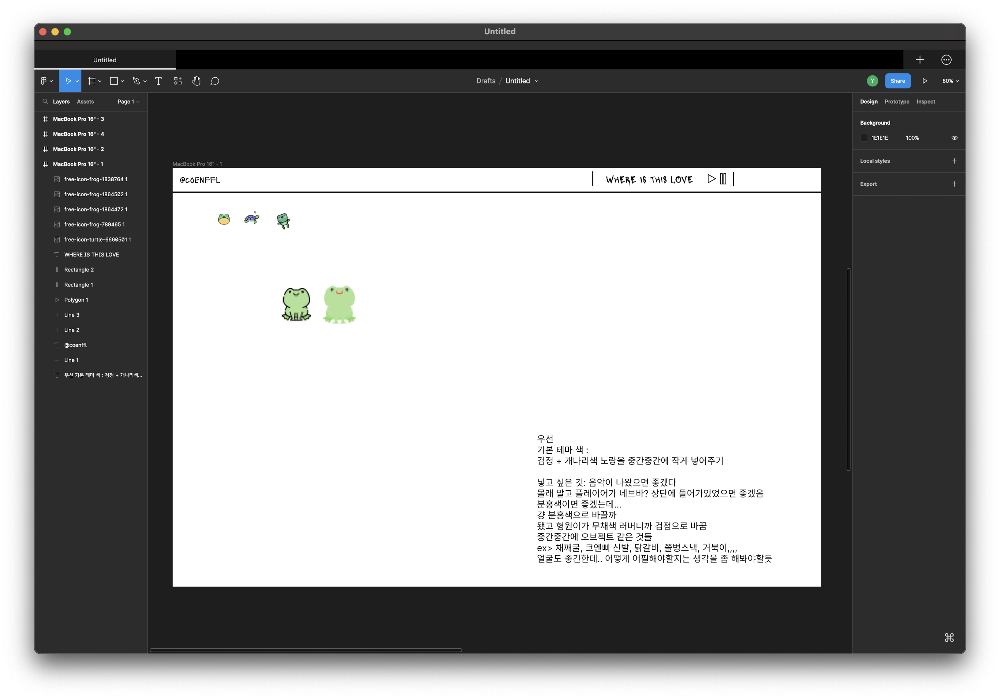

## 230301 개발일지

첫날이라서
메인화면이랑 초입?화면
어떤 식으로 화면이 넘어갈지를 구상해보고 뭐 어떤 이미지를 넣어볼까 찾아보는중인데  
아이디어와 창의력 고갈.
js랑 css 어떻게 썼는지 갑자기 생각이 너무 안나서 큰일이다.

Move와 Scale의 쓰임새를 알게 되었다!
Move는 단순히 요소 하나하나를 옮길때 사용하는 것이고
Scale은 비율을 그대로 유지하면서 크기를 변경하고 싶을 때 사용한다!
스터디원 중에 피그마를 공부하면서 블로그에 적어주시는 분이 계셔서 참고했다!

> https://ericaforcoding.tistory.com/3
